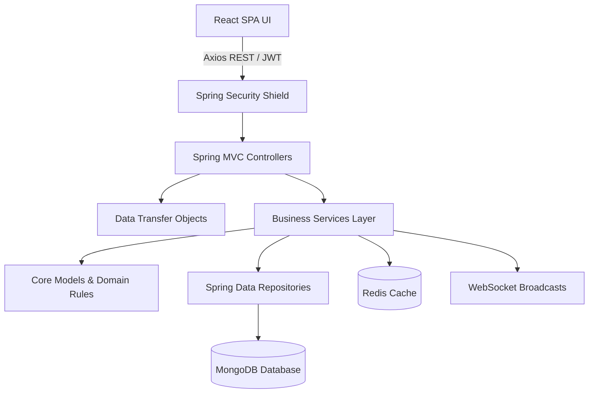
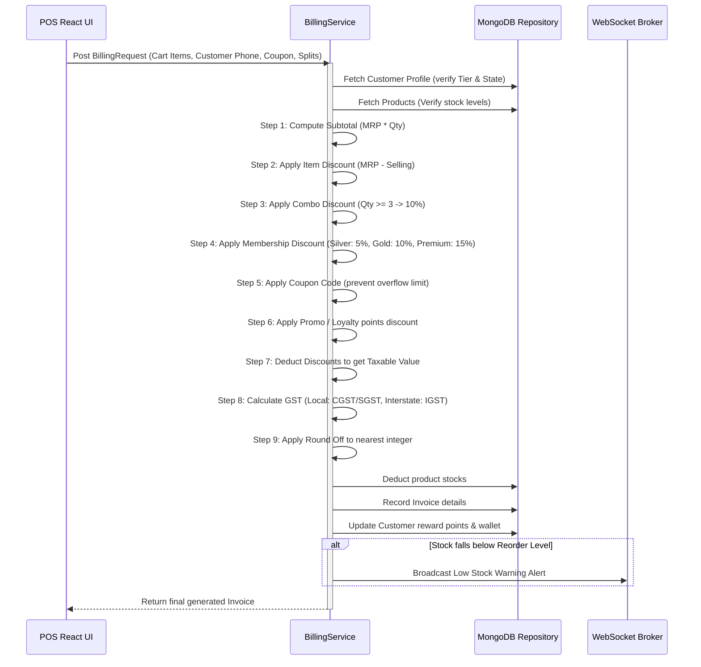
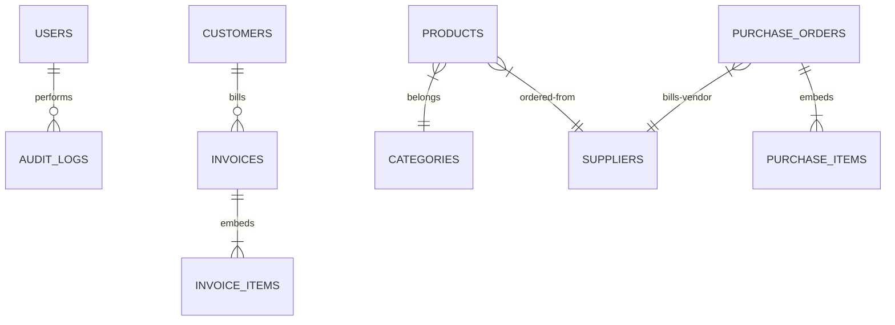

# SmartRetail 360 – Enterprise AI Retail Management Platform

**SmartRetail 360** is a production-ready, cloud-compatible retail ERP and AI-powered billing ecosystem built with a high-performance Java (Spring Boot) backend, a responsive React (TypeScript & Tailwind) frontend, and MongoDB document database storage.

---

## System Architecture

The application adopts **Clean Architecture** principles to isolate business logic from database layers, frameworks, and web presentation adapters.



### Components Responsibility Map:
1. **Presentation Layer**: Built with React, Vite, TS, Tailwind, and Recharts. Keeps state local, manages authentication contexts, and renders POS layouts.
2. **Controller Layer**: REST mappings enforcing `@PreAuthorize` guards, validating request bodies, and packaging results into a unified global `ApiResponse<T>` envelope.
3. **Services Layer**: Orchestrates complex workflows (Billing Engine, GST state logic, AI forecasting queries, low stock triggers).
4. **Repository Layer**: Handles database connection adapters using Spring Data MongoDB.

---

## Sequence Diagram: POS Billing & Calculation

The sequence diagram below displays the strict chronological calculation chain implemented in the GST billing engine:



---

## MongoDB ER Diagram & Database Schema

The database model is designed as referenced document collections for primary entities and embedded documents for cart lines and transaction logs.



### JSON Schema Blueprint Examples:

#### 1. Product Document (`products` collection)
```json
{
  "_id": "603d2e92c2a0c71fb0ff5a01",
  "sku": "SKU-WATER-001",
  "barcode": "8901030012345",
  "name": "Sparkling Mineral Water 500ml",
  "categoryId": "603d2e92c2a0c71fb0ff5a10",
  "brand": "AquaFresca",
  "costPrice": 35.00,
  "sellingPrice": 45.00,
  "mrp": 50.00,
  "gstPercentage": 18.00,
  "hsnCode": "2201",
  "batchNumber": "B-W24-09",
  "totalStock": 150,
  "reorderLevel": 30,
  "warehouseStock": {
    "WH-Karn-01": 100,
    "WH-Tamil-02": 50
  }
}
```

#### 2. Invoice Document (`invoices` collection)
```json
{
  "_id": "603d2e92c2a0c71fb0ff5a02",
  "invoiceNumber": "INV-1719973210",
  "customerId": "603d2e92c2a0c71fb0ff5a20",
  "customerName": "Sushanth Kesava",
  "customerPhone": "9999999999",
  "customerState": "Karnataka",
  "storeState": "Karnataka",
  "items": [
    {
      "productId": "603d2e92c2a0c71fb0ff5a01",
      "productName": "Sparkling Mineral Water 500ml",
      "sku": "SKU-WATER-001",
      "hsnCode": "2201",
      "quantity": 3,
      "mrp": 50.00,
      "sellingPrice": 45.00,
      "costPrice": 35.00,
      "gstPercentage": 18.00,
      "gstAmount": 21.60,
      "discountAmount": 15.00,
      "totalAmount": 141.60
    }
  ],
  "subtotal": 150.00,
  "itemDiscount": 15.00,
  "comboDiscount": 13.50,
  "membershipDiscount": 12.15,
  "couponDiscount": 0.00,
  "storePromotionDiscount": 0.00,
  "taxableValue": 109.35,
  "gstAmount": 19.68,
  "cgst": 9.84,
  "sgst": 9.84,
  "igst": 0.00,
  "roundOff": -0.03,
  "finalAmount": 129,
  "paymentMethod": "CASH"
}
```

---

## Installation & Setup Guide

### System Prerequisites
- **Java**: JBR / OpenJDK 21 or higher
- **Node.js**: v18 or newer (v20+ recommended)
- **Database**: MongoDB server v6.0+ running locally or online (Atlas)
- **Cache**: Redis server v7.0+ (optional, runs on dev bypass)

### Local Development Manual

1. **Database Setup**:
   Launch a local MongoDB server instance. Ensure port `27017` is accessible.

2. **Run Backend Service**:
   ```bash
   cd backend
   mvn clean spring-boot:run
   ```
   The backend will bootstrap on port `8080`. Swagger documentation is accessible at `http://localhost:8080/swagger-ui.html`.

3. **Run Frontend Interface**:
   ```bash
   cd frontend
   npm install
   npm run dev
   ```
   The development server will boot on `http://localhost:5173`.

---

## Docker Compose Deployment Guide

To deploy the entire environment in a containerized environment (Database, Cache, API services, and SPA Nginx):

```bash
# Build and run all services
docker-compose up --build -d

# Verify containers state
docker-compose ps
```

Services exposed:
- **Frontend SPA Client**: `http://localhost` (Port 80)
- **Spring API Engine**: `http://localhost:8080` (Port 8080)
- **MongoDB Instance**: Port 27017

---

## API Collection (Postman Reference)

Import this JSON structure into Postman to run tests on backend REST endpoints:

```json
{
  "info": {
    "name": "SmartRetail 360 REST APIs",
    "schema": "https://schema.getpostman.com/json/collection/v2.1.0/collection.json"
  },
  "item": [
    {
      "name": "Authentication",
      "item": [
        {
          "name": "Admin Registration",
          "request": {
            "method": "POST",
            "header": [],
            "body": {
              "mode": "raw",
              "raw": "{\n  \"username\": \"manager\",\n  \"email\": \"manager@smartretail.com\",\n  \"password\": \"manager123\",\n  \"fullName\": \"Store Manager\"\n}",
              "options": { "raw": { "language": "json" } }
            },
            "url": { "raw": "http://localhost:8080/api/auth/register" }
          }
        },
        {
          "name": "User Login",
          "request": {
            "method": "POST",
            "header": [],
            "body": {
              "mode": "raw",
              "raw": "{\n  \"username\": \"manager\",\n  \"password\": \"manager123\"\n}",
              "options": { "raw": { "language": "json" } }
            },
            "url": { "raw": "http://localhost:8080/api/auth/login" }
          }
        }
      ]
    },
    {
      "name": "POS Invoicing",
      "item": [
        {
          "name": "Cart Checkout",
          "request": {
            "method": "POST",
            "header": [
              { "key": "Authorization", "value": "Bearer {{jwt_token}}", "type": "text" }
            ],
            "body": {
              "mode": "raw",
              "raw": "{\n  \"customerId\": \"\",\n  \"items\": [\n    { \"productId\": \"603d2e92c2a0c71fb0ff5a01\", \"quantity\": 2 }\n  ],\n  \"couponCode\": \"WELCOME10\",\n  \"paymentMethod\": \"CASH\"\n}",
              "options": { "raw": { "language": "json" } }
            },
            "url": { "raw": "http://localhost:8080/api/invoices/checkout" }
          }
        }
      ]
    }
  ]
}
```

---

## Testing Guide

### Running Automated Test Suites
Run Junit tests verifying billing arithmetic, discount caps, and local/interstate CGST/SGST/IGST routes:

```bash
cd backend
mvn test
```

### Manual Verification Checklist
1. **JWT Lockouts**: Enter bad password 5 times on `/login`. Verify "Account Locked" response.
2. **State GST Detection**: Register customer from "Tamil Nadu" and run POS checkout on products. Verify the invoice charges **IGST** (instead of local CGST/SGST split).
3. **Redemption Safety**: Redeem rewards points on small invoice. Confirm points deduction is capped at 20% of taxable value.
